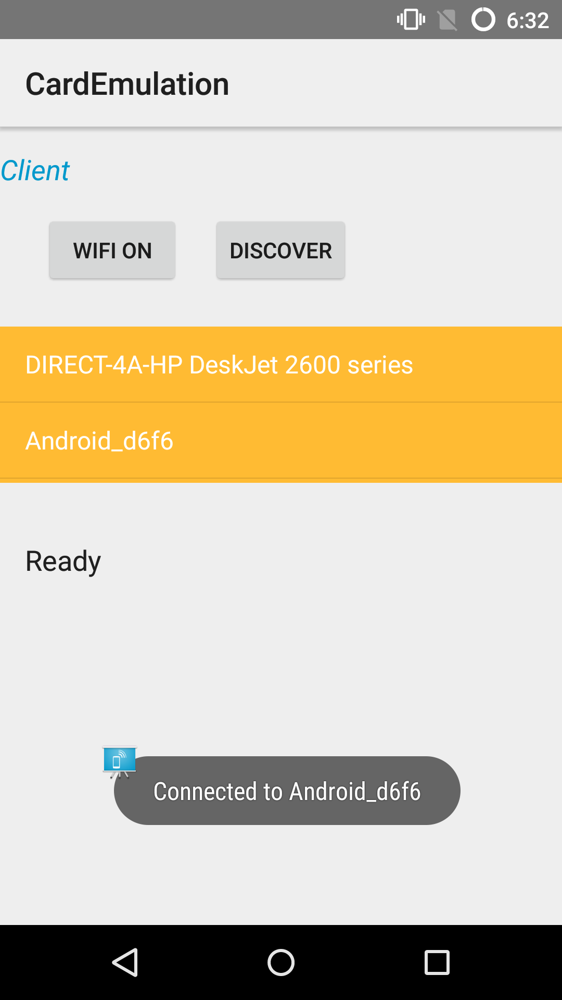
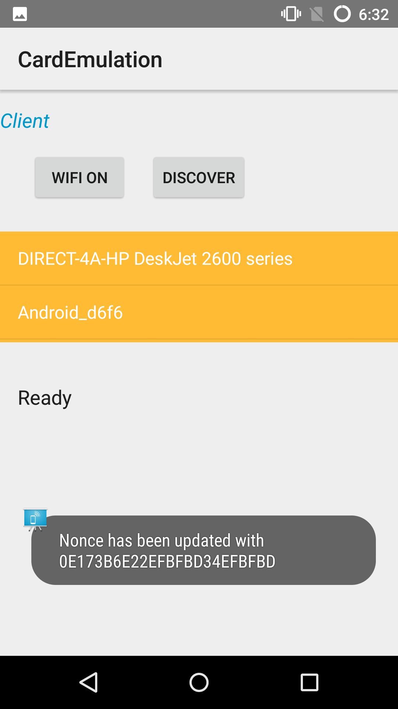
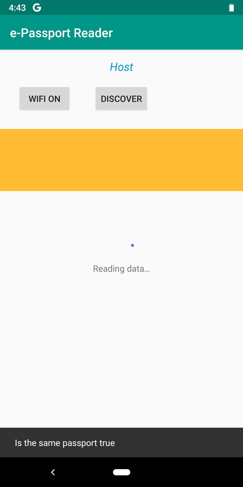

# BAC unlinkability vulnerability exploitation

## Summary

This repository contains a step-by-step explanation of how to reproduce BAC unlinkability vulnerability exploitation described in [this repository](https://github.com/ZDSmith/bac-protocol-unlinkability).

## Operation

For the operation, you have to have at least to phones with NFC support and honest e-passport reader (the third phone can be used as an honest reader, e.g  [https://github.com/tananaev/passport-reader](https://github.com/tananaev/passport-reader)). 

1. Build and deploy apps located in subfolders "passport-emulator-fake" and "passport-reader-fake" to your phones, named fake-epassport and fake-reader.
2. Run both of them and pair them together for wifi p2p communication by clicking on the "Discover" button and selecting a device from the list. Example:

3. Place fake-reader in the vicinity to the real e-passport to initiate the attack and maintain communication until the final step. Nonce received from the e-passport will be relayed to the fake-epassport. 

4. After preloading nonce, one can bring fake-epassport to start communication with hones e-passport reader. Once fake-epassport gets final BAC command, it transfers it to the dishonest reader.

5. As a final step of the exploit, fake-reader will send received command, and in case if the attack has succeeded, you'll receive a toast "It is the same passport true", otherwise toast with a thrown exception.

